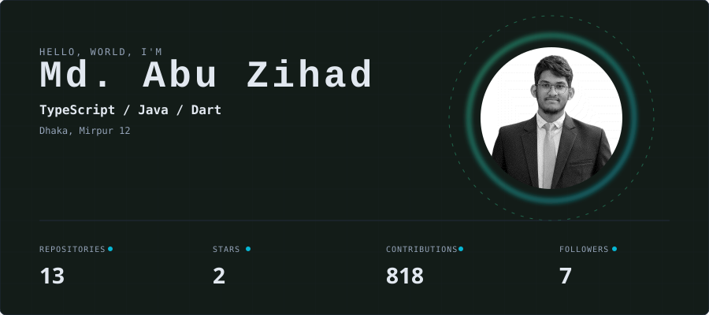
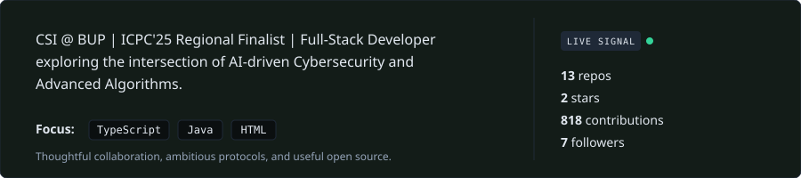
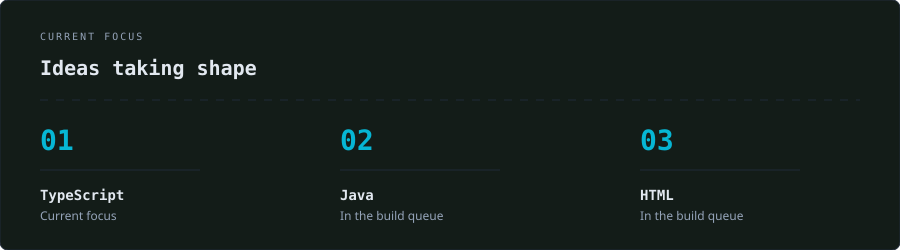
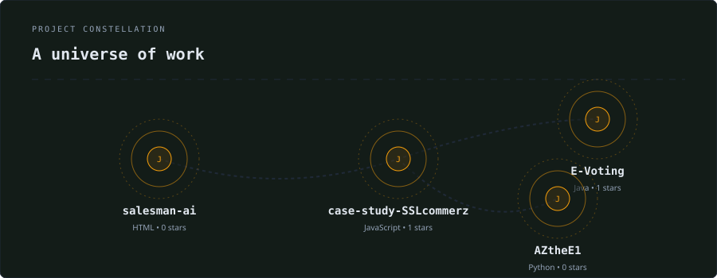
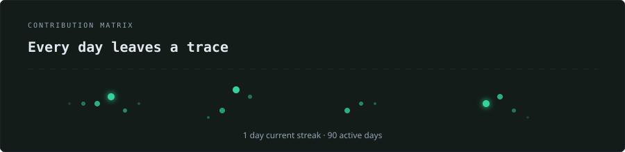

  <code>🔴 🟡 🟢 GITSKINS / LIVING IDENTITY</code>

  

  

<h2 align="left">Identity, with signal</h2>

  

◇──────────────◇

  

<h2 align="left">What moves the work</h2>

 

Positioning is useful when the proof is close behind it.

  

◇──────────────◇

  

<h2 align="left">The tools behind the signal</h2>

 

TypeScript · Java · HTML · Dart · JavaScript · CSS · C++ · CMake · chosen for the work, not the trend

  

◇──────────────◇

  

<h2 align="left">Built, shipped, shared</h2>

  

◇──────────────◇

  

<h2 align="left">The Trail Behind the Work</h2>

